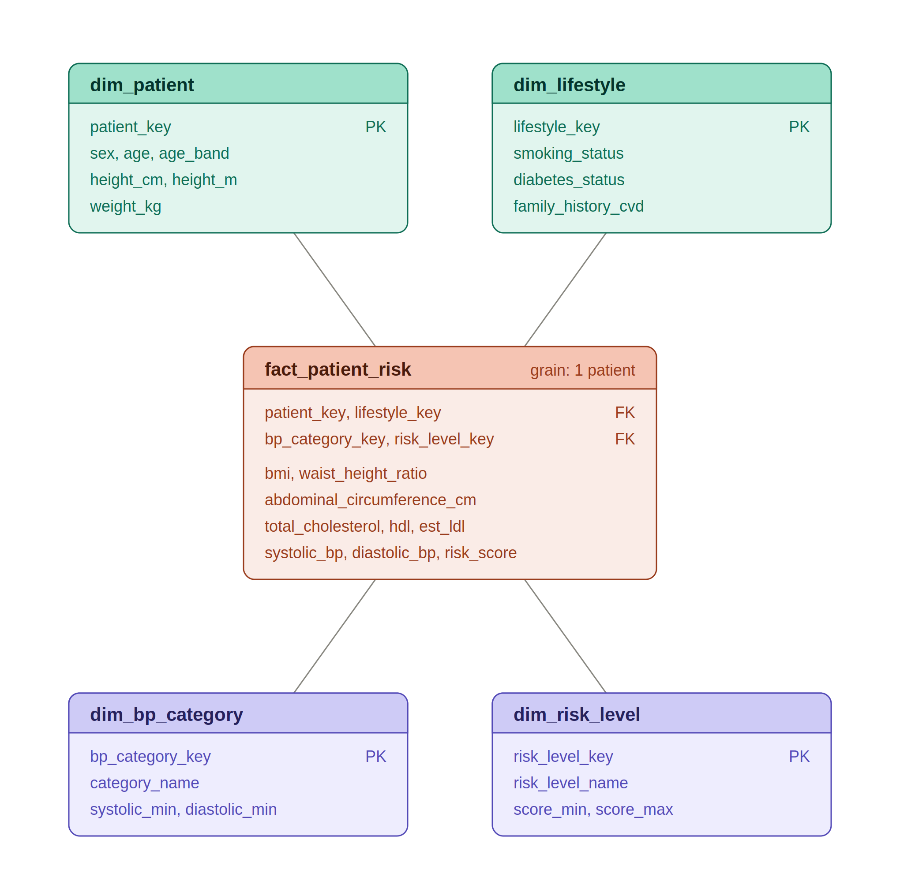
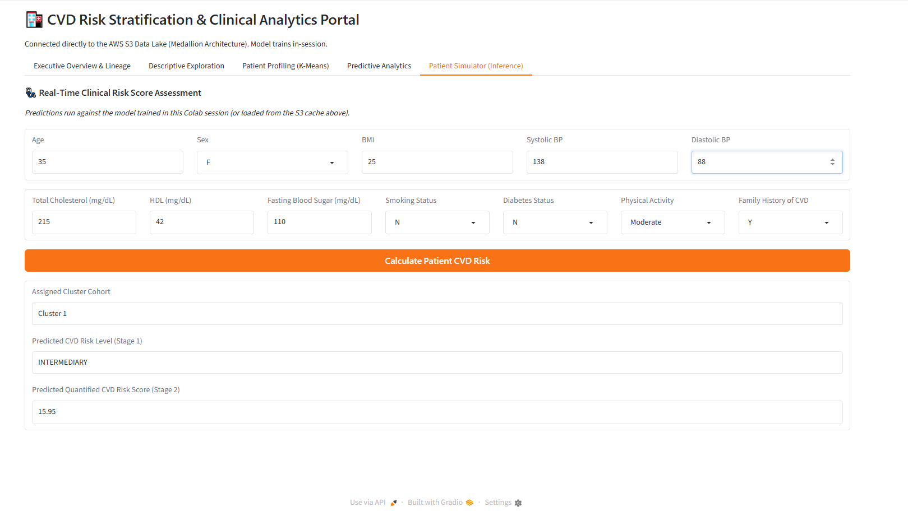

# CVD Risk Stratification & Clinical Analytics Portal

**Group 12: Jered Ross | Mitchell Sears**
**Big Data Analytics in the Cloud**

A cloud data pipeline and machine learning application that predicted cardiovascular disease (CVD) risk from patient screening data, built on an AWS medallion architecture (S3, Glue, Athena, SageMaker, QuickSight) with a Gradio-based clinician-facing application hosted on Google Colab.

---

## Executive Summary

This project turned a static, 1,529-record patient dataset into two deliverables: an executive/clinician dashboard highlighting cardiovascular risk patterns across the patient population, and a two-stage machine learning model that predicted a patient's CVD risk level and quantified risk score from vitals and lifestyle inputs collected during a routine checkup.

The pipeline ingested a raw CSV into S3, cleaned and imputed it through an AWS Glue visual ETL job, converted it to Parquet, and organized it into a bronze/silver/gold medallion structure. Cleaned data was queried through Athena and visualized in QuickSight, while a separate branch trained a two-stage HistGradientBoosting model in SageMaker and served it through a real-time inference endpoint, which a Gradio application (hosted on Google Colab) called for interactive, per-patient predictions.

Key findings included a clear age-related risk gradient (high risk climbed from roughly 40% in patients' 30s to nearly 62% by their 50s), widespread hypertension across the population (73.8% of patients had some level of elevated blood pressure, with 632 patients in Stage 2 hypertension alone), and a strong clustering of multiple risk factors within the same patients (most patients carried two to three of the four tracked risk factors simultaneously).

---

## Business Problem and Stakeholders

Cardiovascular disease affects millions of people worldwide, and many of the factors that drive it are measurable well before a diagnosis. The core question this project addressed was: which factors most commonly indicate elevated cardiovascular risk, and how can screening be streamlined so that patients with those factors receive appropriate priority sooner?

The goal was to give clinicians and executive leadership an earlier, lower-effort way to flag at-risk patients — without requiring a practitioner to manually analyze each patient's lab results. This shifted physician effort away from data review and toward treatment planning, with the aim of improving patient outcomes.

**Primary stakeholders:**
- **Clinicians** — needed a fast, form-based tool to estimate a given patient's cardiovascular risk from data already collected at checkups.
- **Executive leadership** — needed a dashboard summarizing risk trends and key population-level indicators (KPIs) across the patient base.

**What was built for each:**
1. An executive/clinical dashboard (QuickSight) summarizing patient population health KPIs within the cardiovascular space.
2. A classification and regression model (SageMaker), served through an interactive application, that estimated whether a patient was at low, intermediate, or high risk of developing cardiovascular disease.

---

## Architecture


The pipeline followed a medallion architecture across four stages:

1. **Ingestion** — The raw CVD dataset (CSV, sourced from Kaggle) was uploaded to the S3 raw/bronze zone unmodified, preserving the original file.
2. **Transformation (AWS Glue)** — A visual ETL job cleaned, imputed, and validated the data, converting it from CSV to Parquet along the way to reduce storage footprint and query cost. The job also built row-level data quality checks with pass/fail routing: passing rows moved to the silver layer, and failing rows (e.g., missing target values) were routed to a dedicated rejected folder rather than being silently dropped or imputed.
3. **Storage and query** — Cleaned data landed in the silver layer, with a Glue Data Catalog table registered on top so Athena could query it directly via SQL, with no data warehouse required.
4. **Output** — From the silver/gold layers, two parallel outputs were produced: a QuickSight executive dashboard built on top of Athena, and a SageMaker-trained risk model deployed to a real-time inference endpoint, called from a third-party Gradio application hosted on Google Colab.

**Main AWS services:** S3 (storage), Glue (ingestion and transformation), Athena (querying), SageMaker (model training and hosting), and QuickSight (executive dashboarding).

---

## Dataset

**Source:** Kaggle, static CSV (`CVD-risk_data.csv`, ~167 KB)
**Size:** 1,529 patient records, 22 columns spanning demographics, body measurements, vitals, and blood test results.

### Data Dictionary — Raw Source Fields

| Column | Type | Description |
|---|---|---|
| `Sex` | Categorical | Patient sex (`M` / `F`) |
| `Age` | Integer | Patient age in years |
| `Weight (kg)` | Decimal | Body weight |
| `Height (m)` | Decimal | Height in meters |
| `BMI` | Decimal | Body mass index |
| `Abdominal Circumference (cm)` | Decimal | Waist/abdominal measurement |
| `Blood Pressure (mmHg)` | String | Combined `systolic/diastolic` reading (e.g. `125/79`); split into separate fields during ETL |
| `Total Cholesterol (mg/dL)` | Integer | Total blood cholesterol |
| `HDL (mg/dL)` | Integer | High-density lipoprotein cholesterol |
| `Fasting Blood Sugar (mg/dL)` | Integer | Fasting glucose level |
| `Smoking Status` | Categorical | `Y` / `N` |
| `Diabetes Status` | Categorical | `Y` / `N` |
| `Physical Activity Level` | Ordinal categorical | `Low` / `Moderate` / `High` |
| `Family History of CVD` | Categorical | `Y` / `N` |
| `Height (cm)` | Integer | Height in centimeters (redundant with `Height (m)`) |
| `Waist-to-Height Ratio` | Decimal | Abdominal circumference divided by height |
| `Systolic BP` | Integer | Systolic blood pressure |
| `Diastolic BP` | Integer | Diastolic blood pressure |
| `Blood Pressure Category` | Ordinal categorical | Clinical BP classification (e.g. Normal, Elevated, Hypertension Stage 1/2) |
| `Estimated LDL (mg/dL)` | Integer | Low-density lipoprotein cholesterol (estimated) |
| `CVD Risk Score` | Decimal | Continuous risk score — **regression target** |
| `CVD Risk Level` | Ordinal categorical | `LOW` / `INTERMEDIARY` / `HIGH` — **classification target** |

### Data Dictionary — Engineered / Derived Fields (Silver Layer)

| Field | Type | Description |
|---|---|---|
| `age_band` | Integer | Patient age rounded down to the nearest 10-year band; used for grouped imputation |
| `<field>_was_imputed` | Boolean | One flag per imputed numeric column, `True` where the value was filled rather than measured |

### Star Schema — Gold Layer



The gold layer organized cleaned data into a star schema centered on `fact_patient_risk`, joined to `dim_patient`, `dim_lifestyle`, `dim_bp_category`, and `dim_risk_level`. This structure supported dashboard development but was not used directly by the ML model, which trained against the flat silver-layer table instead.

---

## Data Quality, Governance, and Cleanup

Prior to cleaning, more than half of all rows contained at least one null value across some column, and several fields (patient weight, height in meters, waist-to-height ratio, cholesterol, and the CVD risk score itself) were affected. A custom Glue transform grouped patients by sex and 10-year age band and imputed missing numeric values using the median of that group, rather than a single dataset-wide average, to better reflect that measurements like cholesterol vary meaningfully by age and demographic group. Rows missing critical fields (such as the target risk score) were routed to a rejected folder rather than imputed, preserving the integrity of the training target.

Cost control was addressed through AWS budget alerts configured to notify the team if spending approached a set threshold. Converting to Parquet kept S3 storage and Athena query costs low. Once the ML and dashboard outputs were finalized, S3 buckets and Glue ETL jobs were scheduled for deletion to avoid ongoing charges.

---

## Key Findings and Insights

**Risk by age:** High risk climbed from roughly 39.9% of patients in their 30s to a peak of 61.8% in patients in their 50s, tapering in the 60s and 70s. Patients in their 20s showed unusually high variance (as high as 44% and as low as 30% risk), which was consistent with a small sample size in that age band (96 patients) rather than a genuine reversal of the age trend. Patients in their 30s trended most heavily toward intermediate risk.

**Hypertension prevalence:** 632 patients were in Stage 2 hypertension and 497 in Stage 1 — together, more than half the patient population had blood pressure exceeding normal limits. Elevated blood pressure alone does not guarantee a patient will develop cardiovascular disease, but it is one of the strongest known risk factors, and its prevalence here was a notable population-level signal.

**Compounding risk factors:** Most patients carried multiple simultaneous risk factors (smoking, diabetes, family history, and hypertension). 485 patients had three of the four tracked risk factors, and 444 had two. This clustering suggested that a meaningful share of the patient population would benefit from closer monitoring even without a single dominant risk factor driving concern on its own.

**Relative prevalence:** Across all tracked factors, hypertension was the most common (73.8% of patients had some level of elevated blood pressure), followed by diabetes, with roughly a third of patients identified as smokers.

---

## Model

A two-stage HistGradientBoosting pipeline was trained in SageMaker:

1. **Stage 1 — Classification:** `HistGradientBoostingClassifier` predicted `CVD Risk Level` (`LOW` / `INTERMEDIARY` / `HIGH`) from patient demographics, vitals, and lifestyle features.
2. **Stage 2 — Regression:** `HistGradientBoostingRegressor` predicted the continuous `CVD Risk Score`, using Stage 1's predicted risk level as an additional input feature.

The trained model was packaged and deployed to a SageMaker real-time inference endpoint, invoked from the Gradio application via `boto3` for interactive, per-patient predictions.

### Application


[Visit our App!](https://2c08a05f3f34e38c36.gradio.live/)

The portal was organized into five tabs:
- **Executive Overview & Lineage** — population-level KPIs and a data quality/imputation audit sourced from the Glue ETL flags.
- **Descriptive Exploration** — correlation analysis across biometric features.
- **Patient Profiling (K-Means)** — unsupervised clustering of patients into clinical cohorts, with an adjustable cluster count.
- **Predictive Analytics** — model performance metrics (R², MAE, RMSE) and a smoking-vs-risk hypothesis test.
- **Patient Simulator (Inference)** — an interactive form where a clinician entered a patient's vitals and lifestyle data and received a predicted risk level, quantified risk score, and cluster cohort assignment in real time.

---

## Risks and Future Improvements

**Imputation scale:** Over 50% of rows contained at least one null value prior to cleaning. Filling values at that scale, even with demographic-aware medians rather than a single global average, carries a real risk of skewing the data toward central tendency and diluting genuine outliers. A future iteration would prioritize a dataset with a lower null rate, or substantially more records, so that imputation affects a smaller share of the training data.

**Target/label leakage risk:** Because `CVD Risk Level` was used as an input feature to the Stage 2 regression model, and both fields likely derive from a related underlying scoring logic, the model's high R² and low RMSE may partly reflect the model decoding a known relationship between the two target fields rather than learning a fully independent predictive signal from patient features alone. A future improvement would be to drop `CVD Risk Level` as a Stage 2 input and let the regressor learn `CVD Risk Score` independently.

**Model staleness:** New data continues to land in S3 as additional patient records are simulated, but the Gradio application caches whichever trained model was last stored in S3 and does not automatically retrain or refresh when new data arrives. Keeping the deployed model current currently requires a manual cache refresh.

**Gold layer utilization:** The star schema in the gold layer simplified dashboard development and querying but was not used by the ML model, which trained directly against the flat silver-layer table. Whether the added complexity of maintaining separate dimension tables was worth it, given they weren't part of the ML path, remains an open question.

---

## Cost Estimates and Control

Parquet conversion kept S3 storage and Athena query costs low, since Athena bills per megabyte scanned and Parquet's columnar, partitioned format scans far less data than raw CSV for the same query. Glue and QuickSight made up the largest share of the total cost. AWS budget alerts were configured to flag spending if it approached a set threshold, and S3 buckets and Glue jobs were slated for deletion once outputs were finalized to avoid continued charges.

---

## AWS / GCP Trade-off

| Layer | What we used on AWS | The GCP equivalent |
|---|---|---|
| **Storage** | S3, organized into medallion layers — cheap, simple, and repeatable, and allowed us to customize our datasets by folder | Cloud Storage is nearly identical on GCP; not a meaningful differentiator at this scale |
| **ETL** | Glue Visual ETL — let us transform and customize our data visually, and made it straightforward to route rejected rows to their own folder | Dataflow or Dataproc are more powerful, but require writing and maintaining pipeline code ourselves |
| **Query** | Athena — serverless, pay-per-MB-scanned, and cheap specifically because we partitioned the data and used Parquet | BigQuery offers somewhat stronger default performance and requires less manual tuning, which may be a better fit for this workload |
| **ML** | SageMaker — train, host, and invoke via `boto3` directly from our Gradio app; a tight fit with the rest of the AWS stack | Vertex AI offers comparable capability with a cleaner AutoML path, but doesn't represent a meaningful trade-off for this project's scope |
| **BI** | QuickSight — integrates directly with Athena, similar to other visualization tools | Looker Studio offers essentially the same functionality, with some features behind a paid tier |

---

## Repository Structure

```
.
├── README.md
├── docs/
│   └── images/
│       ├── architecture.png
│       ├── star_schema.png
│       └── app_screenshot.png
├── etl/
│   └── glue_etl_job.py          # AWS Glue visual ETL: Change Schema → Custom Transform → Evaluate Data Quality → S3 (silver / rejected)
├── model/
│   ├── cvd_risk_model_packaging.py   # Trains the two-stage model and registers it as a SageMaker Model
└── app/
    └── gradio_app_cardiovascular.py             # Gradio application; calls the SageMaker endpoint for live inference
```

---

## AI Use Note
Gemini and Claude were used for the following:
- Debugging model
- Gradio application build out
- Proof-reading and alignment within report
- Custom transformation script development within AWS Glue. 

## Team

**Group 12** — Jered Ross, Mitchell Sears
Course: Big Data Analytics in the Cloud
